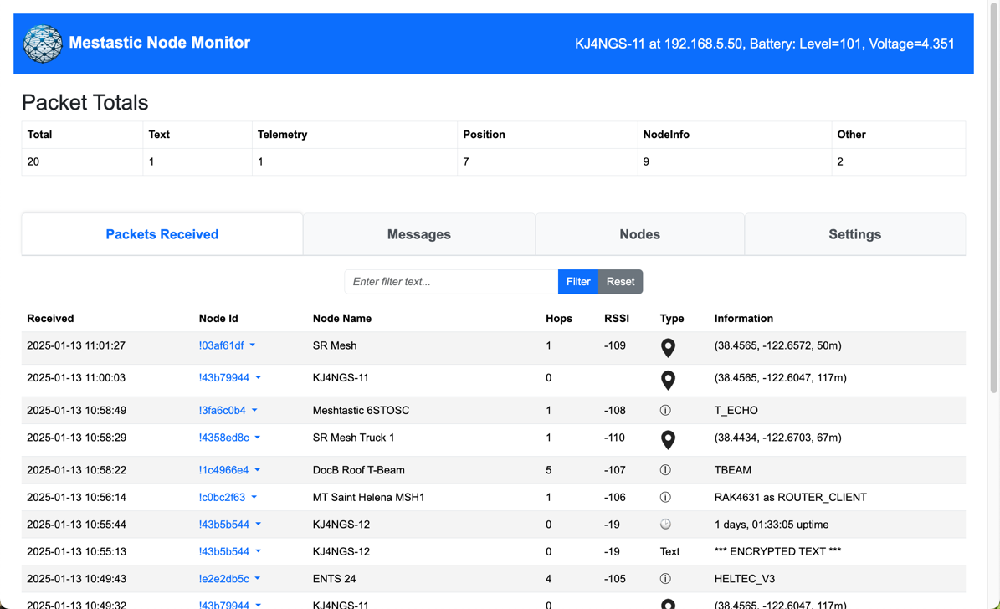
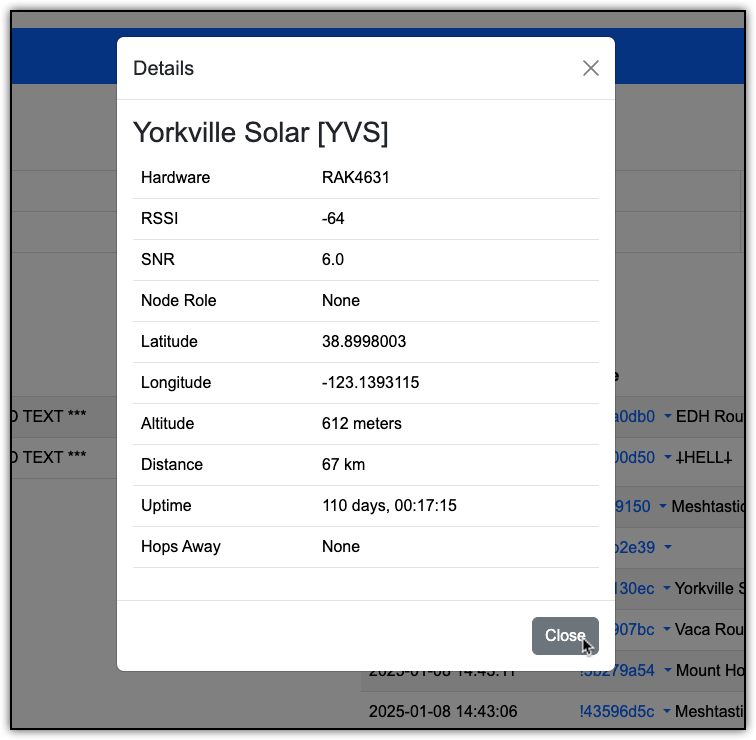

# Meshtastic Monitor

This program was created because I wanted to have a better idea of what was going on in my Meshtastic neighgorhood, and I wanted to have a better sense of what happened when I sent / received messages.

It uses the Python API to talk to a local node over HTTP or Serial (although I'm sure you could modify it to work over BLE).

Here's what the display looks like:



Across the top are a count of packet types received.

The left panel logs all text messages received; if they are encrypted and we cannot decode them, it simply says `*** ENCRYPTED TEXT ***`.

The right panel logs all packets seen and, in many cases, reports some interesting information from them (but by all means not all of the information).

If you click on a node in the right panel, you have two choices:


Open in Map will open a Meshtastic map in a new tab and focus on the node in question.

View Details opens a pop-up:




## Running

Create a virtual environment for the project:

```sh
python -m venv .venv
source .venv/bin/activate
```

(On Windows, something like that, I presume)


Install the required packages:

```sh
pip install -r requirements.txt
```


To run the app:

* For connection over WiFi: `python app.py ip-address-of-node`
* For connection over Serial: `python app.py /dev/...`

There are default connections in mesh.py if you don't provide an ip-address or serial device.

It will open a browser window to the app on its own.

There's a shell script, start.sh, that activates the virtual environment and runs the app.


## Notes of Interest


1. The program creates a file packetlog.txt with all the packets it receives during the run.  It's useful for debugging.  Unlike the display, which is limited to a maximum number of records, the file grows endlessly as the program is run.  However, it is truncated when the program starts.  You can change the line `with open('packetlog.txt', 'w') as f:` in listener.py from `'w'` to `'a'` if you don't want to reset the log after every run.
2. When the computer sleeps, the program gets lost.  Just restart it.
3. There are times when Chrome says "Aw Snap!".  Not sure why, but just refresh the page and nothing is lost.


**Final Node:**

I wrote this program so I could understand what the nodes were doing.  I started from knowing nothing, and there may well be some ignorance that persists in the program. Probably a lot.  Feel free to fix anything you don't like :-).

